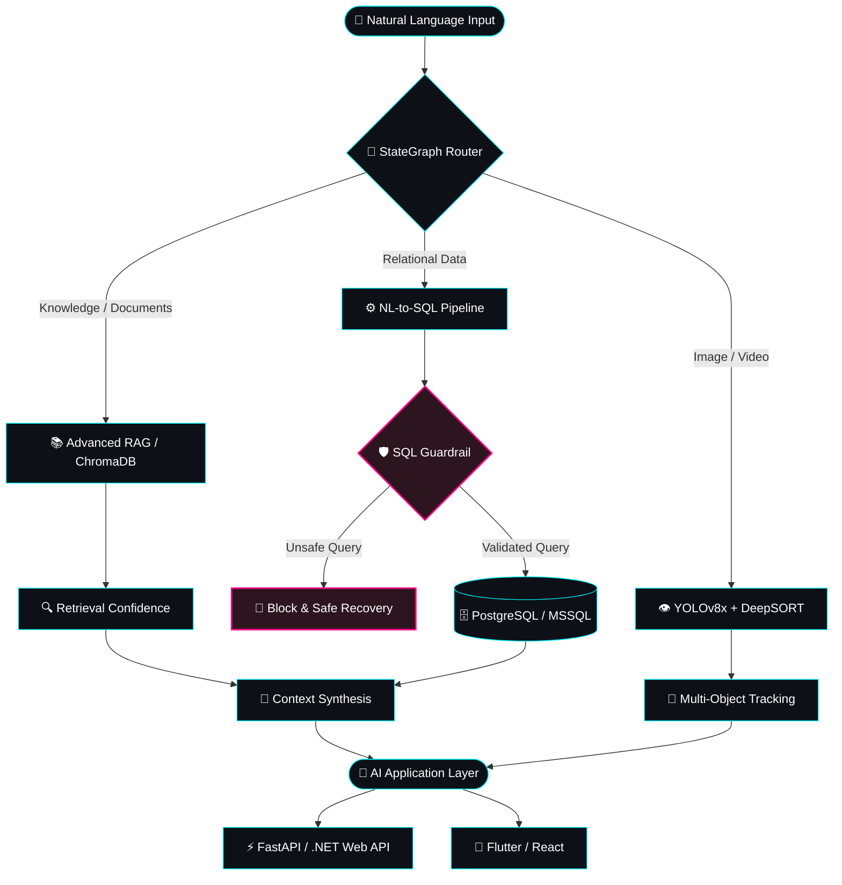

<div align="center">

  

  <a href="https://mertozyagli.com.tr">
    
  </a>

  <p align="center">
    <a href="https://mertozyagli.com.tr" target="_blank">
      
    </a>
    <a href="mailto:mertozyagli0@gmail.com">
      
    </a>
    <a href="https://github.com/izzet7979" target="_blank">
      
    </a>
    
  </p>

</div>

---

## 🧬 About Me

I'm a **Software Engineer** focused on building intelligent, scalable and production-oriented software systems.

My main area of expertise is **Artificial Intelligence**, especially:

- 🤖 Multi-Agent Systems
- 🔗 RAG (Retrieval-Augmented Generation)
- 🧠 LLM Applications
- 🛡️ AI Guardrails & Secure AI Pipelines
- 🔍 Natural Language to SQL
- 🗣️ NLP & Transformer-based Systems
- 👁️ Computer Vision
- 🧬 Deep Learning
- ⚙️ AI Agent Architectures

I also develop modern **web, backend and mobile applications**, combining AI systems with technologies such as **.NET, FastAPI, React and Flutter**.

I enjoy turning research-oriented AI concepts into practical, end-to-end applications.

---

## 🧭 AI System Architecture


````

---

## 🎓 Education

### 🎓 Atatürk University

**B.Sc. in Software Engineering**

`September 2022 – June 2026`

**GPA:** `3.55 / 4.00`

### 🎓 Atatürk University

**M.Sc. in Software Engineering**

`June 2026 – Present`

### 📊 ALES 2026/1

**Quantitative Score:** `79`

**Ranking:** `15,841`

---

## 💼 Experience

### 🏢 Siren Bilişim & Yazılım Ltd. Şti.

**Artificial Intelligence Intern**

`February 2026 – June 2026 | Ankara, Türkiye`

- Developed intelligent filtering infrastructure for recruitment and candidate search using **LangGraph**.
- Designed natural-language-driven candidate filtering pipelines.
- Migrated an initial RAG-based candidate search architecture toward a **Natural Language to SQL** approach to improve database querying efficiency and reduce unnecessary LLM token usage.
- Developed a custom **SQL Guardrail Node** to detect potentially dangerous SQL operations such as `DELETE`, `DROP` and `INSERT`.
- Implemented controlled query validation to protect database integrity.
- Worked with **Python, LangChain, LangGraph, OpenAI LLMs and PostgreSQL**.
- Contributed to AI-powered enterprise applications integrating LLM workflows with backend systems.

**Tech Stack:**

`Python` `LangChain` `LangGraph` `OpenAI` `PostgreSQL` `RAG` `NL-to-SQL`

---

# 🌟 Featured Projects

```text
├── 🤖 Securitas AI Support Agent
│   └── Multi-Agent RAG + Sliding Window Memory
│       LangGraph + Python + .NET Core
│
├── 🔍 CallWiser AI
│   └── Natural Language → SQL Pipeline
│       Guardrail Security Node + PostgreSQL
│
├── ⚖️ LegalMind AI
│   └── AI-powered Legal Support Assistant
│       RAG + Topic Classification + Dynamic Fallback + Flutter
│
├── 🌐 Personal AI Assistant
│   └── Vector Database Powered Personal AI Agent
│       RAG + LLM + Web Integration
│
├── 🫁 Pneumothorax AI Agent
│   └── Clinical Literature-based RAG Assistant
│       LangGraph + RAG + Hallucination Control
│
├── 💬 SEZENCİK AI
│   └── Turkish Transformer-based Conversational AI
│       Memory + NLP + Deep Learning
│
├── 🎯 UAV Detection & Tracking
│   └── Real-Time UAV Detection System
│       YOLOv8x + DeepSORT + Kalman Filter
│
├── 🩻 COVID-19 Detection System
│   └── Chest X-Ray Classification
│       ResNet + Transfer Learning
│
├── 📱 E-Yazılım
│   └── Programming Education Platform
│       Java + Android + Firebase
│
└── ❤️ SMA Donation Platform
    └── Transparent Donation Management Platform
        Web + Database + User Management
```

---

## 🤖 AI & Machine Learning

### 🧠 Generative AI

- Multi-Agent Systems
- AI Agents
- LangGraph
- LangChain
- RAG
- Advanced RAG
- Vector Search
- LLM Applications
- Prompt Engineering
- NL-to-SQL
- AI Guardrails
- Hallucination Detection
- Sliding Window Memory
- Retrieval Confidence

### 🧬 Deep Learning

- PyTorch
- TensorFlow
- Keras
- CNN
- LSTM
- ResNet
- Transfer Learning
- Neural Networks

### 👁️ Computer Vision

- YOLOv8
- DeepSORT
- Kalman Filter
- OpenCV
- Object Detection
- Object Tracking
- Centroid Tracking
- Real-Time Computer Vision

### 🗣️ NLP

- Natural Language Processing
- Transformer Architectures
- Text Classification
- Topic Classification
- Sentiment Analysis
- Turkish NLP
- Conversational AI

---

# 💻 Software Development

### Backend

- .NET 8 / ASP.NET Core Web API
- FastAPI
- Flask
- REST APIs
- Entity Framework Core
- Layered Architecture
- Clean Architecture Concepts
- Authentication & Authorization
- JWT

### Frontend & Mobile

- React
- Flutter
- Android / Java
- HTML
- CSS
- JavaScript

### Databases

- PostgreSQL
- Microsoft SQL Server
- MySQL
- Firebase
- ChromaDB
- Vector Databases

### Programming Languages

```text
Python
C#
Java
C
C++
PHP
Dart
JavaScript
SQL
```

---

# 🛠️ Tools & Technologies

<p align="center">


<br/>


<br/>


</p>

---

# 🧠 AI Engineering Stack

```text
                    ┌──────────────────────────┐
                    │      AI APPLICATIONS     │
                    └────────────┬─────────────┘
                                 │
                    ┌────────────▼─────────────┐
                    │     Multi-Agent Layer    │
                    │   LangGraph / LangChain  │
                    └────────────┬─────────────┘
                                 │
             ┌───────────────────┼───────────────────┐
             │                   │                   │
             ▼                   ▼                   ▼
        ┌─────────┐        ┌──────────┐        ┌──────────┐
        │   RAG   │        │ NL-to-SQL│        │ Vision AI│
        └────┬────┘        └─────┬────┘        └────┬─────┘
             │                   │                  │
             ▼                   ▼                  ▼
        ChromaDB             Guardrails       YOLO / OpenCV
             │                   │                  │
             └───────────────────┼──────────────────┘
                                 │
                    ┌────────────▼─────────────┐
                    │       Backend Layer      │
                    │ .NET / FastAPI / Flask   │
                    └────────────┬─────────────┘
                                 │
                    ┌────────────▼─────────────┐
                    │     Web & Mobile Apps    │
                    │ React / Flutter / APIs   │
                    └──────────────────────────┘
```

---

# 📱 Current Development Focus

### 🚀 LearnFlow

An interactive programming education platform designed to make programming learning more structured and practical.

**Current MVP:**

```text
Python Learning
      ↓
Interactive Lessons
      ↓
Code Examples
      ↓
Quizzes
      ↓
Progress Tracking
      ↓
User Authentication
```

**Planned Languages:**

`Python` `Java` `C#` `JavaScript` `SQL`

**Technology Direction:**

`React` `ASP.NET Core` `.NET 8` `SQL Server` `Entity Framework Core`

---

# 🫁 Pneumothorax AI Agent

An AI assistant designed around pneumothorax-related medical literature and document retrieval.

### Architecture

```text
User Question
      ↓
LangGraph Agent
      ↓
Query Processing
      ↓
Vector Retrieval
      ↓
Clinical Literature
      ↓
Context Validation
      ↓
Hallucination Control
      ↓
LLM Response
```

**Technologies:**

`Python` `FastAPI` `LangGraph` `RAG` `ChromaDB` `OpenAI`

---

# 🎯 UAV Detection & Tracking

A real-time computer vision system developed for the **TEKNOFEST Fighting UAV Competition**.

### Pipeline

```text
Camera
  ↓
YOLOv8x
  ↓
Object Detection
  ↓
DeepSORT
  ↓
Kalman Filter
  ↓
Multi-Object Tracking
  ↓
Stable Target Coordinates
```

**Technologies:**

`Python` `YOLOv8x` `DeepSORT` `Kalman Filter` `OpenCV`

---

# ⚖️ LegalMind AI

An AI-powered legal assistance application developed with a focus on Turkish legal documents.

### Core Architecture

```text
User Question
      ↓
Topic Classification
      ↓
Legal Domain Detection
      ↓
RAG Retrieval
      ↓
Relevant Legal Documents
      ↓
LLM
      ↓
Context-Aware Response
```

**Legal Areas:**

`İş Hukuku` `Aile Hukuku` `Kira` `Borçlar` `Tüketici` `Medeni Hukuk`

**Technologies:**

`Flutter` `Firebase` `Python` `ChromaDB` `OpenAI` `RAG`

---

# 📜 Certifications

### Turkcell Geleceği Yazanlar

- OpenCV 101–501
- Python 101–401
- Temel Linux 101–401
- Veri Manipülasyonu
- İleri Java
- NLP

### BTK Akademi

- Flutter ile Mobil Uygulama Geliştirme
- Yazılım Testine Giriş
- C Programlama
- Temel Yazılım Eğitimleri

### YÖK Veri Analizi Okulu

**Yapay Zekâ Modülü**

- Python
- R
- SPSS
- Veri Analizi
- Yapay Zeka

### CISCO

- Introduction to Cybersecurity

---

# 🏆 Achievements

### 🛩️ TEKNOFEST 2025

**Savaşan İHA Yarışması**

AI-powered UAV detection and tracking systems.

### 🚗 TEKNOFEST 2024

**Ulaşımda Yapay Zeka Yarışması**

Computer vision and artificial intelligence focused project development.

---

# 📊 GitHub Statistics

<p align="center">


</p>

<p align="center">


</p>

---

# 🐍 Contribution Snake

<p align="center">


</p>

---

# 📈 Engineering Activity

```text
┌────────────────────────────────────────────────────┐
│                 AI ENGINEERING                     │
├────────────────────────────────────────────────────┤
│                                                    │
│  Multi-Agent Systems       ████████████████████    │
│  RAG & Vector Search       ███████████████████     │
│  Deep Learning             █████████████████      │
│  Computer Vision           ████████████████       │
│  Backend Development       ███████████████████    │
│  Mobile Development        ███████████████        │
│  Full-Stack Development    █████████████████      │
│                                                    │
└────────────────────────────────────────────────────┘
```

---

# 🌐 Connect With Me

<p align="center">

<a href="https://mertozyagli.com.tr">

</a>

<a href="https://github.com/izzet7979">

</a>

<a href="mailto:mertozyagli0@gmail.com">

</a>

</p>

---

# ⚡ Engineering Philosophy

```text
"Build systems that are not only intelligent,
but also reliable, secure and production-ready."
```

I focus on combining:

**Artificial Intelligence + Software Engineering + Product Development**

to build systems that can move from an idea to a real-world application.

---

<div align="center">

### 🚀 AI Engineer | Software Engineer | Builder

**Designing intelligent systems.
Building scalable software.
Turning ideas into products.**

<br/>


</div>
```
