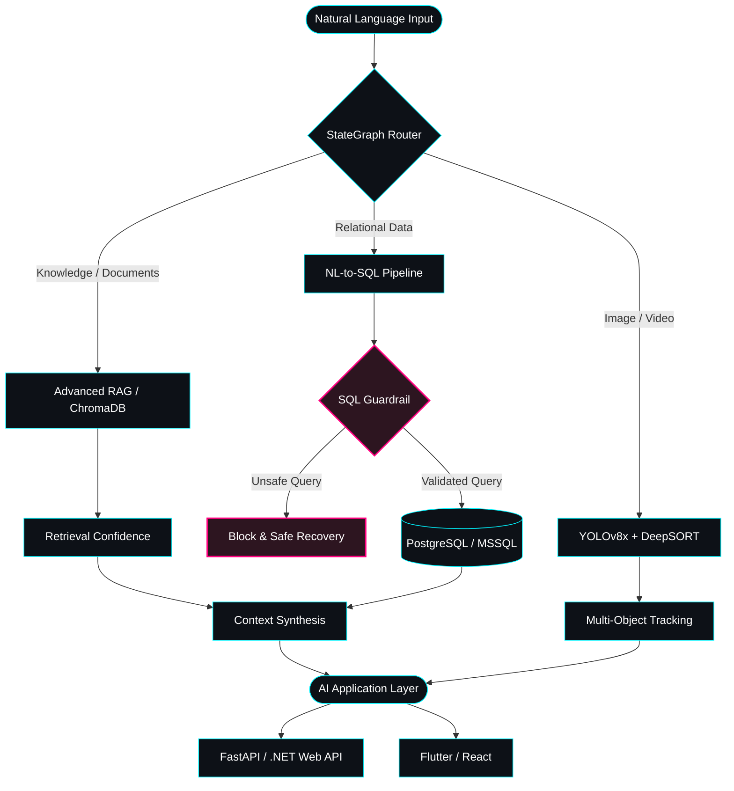
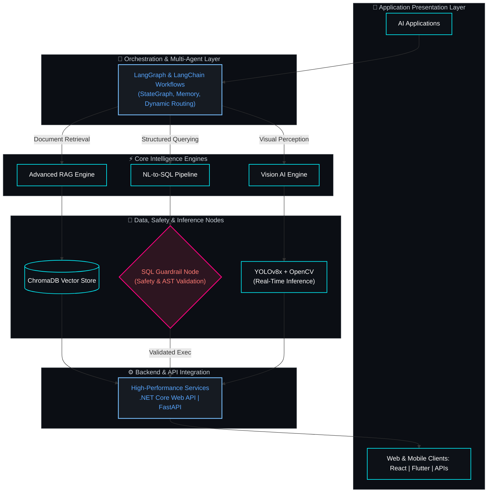

<div align="center">

  <!-- Header Banner (GitHub Proxy Uyumlu) -->
  

  <br/><br/>

  <!-- Daktilo Animasyonlu Başlık -->
  <a href="https://mertozyagli.com.tr" target="_blank">
    
  </a>

  <br/><br/>

  <!-- Rozetler -->
  <p align="center">
    <a href="https://mertozyagli.com.tr" target="_blank">
      
    </a>
    &nbsp;
    <a href="mailto:mertozyagli0@gmail.com">
      
    </a>
    &nbsp;
    <a href="https://github.com/izzet7979" target="_blank">
      
    </a>
    &nbsp;
    
  </p>

  <br/>

</div>

> 💡 *Looking for unlisted or enterprise repositories? Feel free to reach out via [email](mailto:mertozyagli0@gmail.com) for codebase access or project walkthroughs.*

## 🧬 About Me

I'm a **Software Engineer** focused on building intelligent, scalable and production-oriented software systems.

My main area of expertise is **Artificial Intelligence**, especially:

- 🤖 Multi-Agent Systems
- 🔗 RAG (Retrieval-Augmented Generation)
- 🧠 LLM Applications
- 🛡️ AI Guardrails & Secure AI Pipelines
- 🔍 Natural Language to SQL
- 🗣️ NLP & Transformer-based Systems
- 👁️ Computer Vision
- 🧬 Deep Learning
- ⚙️ AI Agent Architectures

I also develop modern **web, backend and mobile applications**, combining AI systems with technologies such as **.NET, FastAPI, React and Flutter**.

I enjoy turning research-oriented AI concepts into practical, end-to-end applications.
---

## 🧭 AI System Architecture



---

## 🎓 Education

### 🎓 Atatürk University

**B.Sc. in Software Engineering**

`September 2022 – June 2026`

**GPA:** `3.55 / 4.00`

### 🎓 Atatürk University

**M.Sc. in Software Engineering**

`June 2026 – Present`

### 📊 ALES 2026/1

**Quantitative Score:** `79`

**Ranking:** `15,841`

---

## 💼 Experience

### 🏢 Siren Bilişim & Yazılım Ltd. Şti.

**Artificial Intelligence Intern**

`February 2026 – June 2026 | Ankara, Türkiye`

- Developed intelligent filtering infrastructure for recruitment and candidate search using **LangGraph**.
- Designed natural-language-driven candidate filtering pipelines.
- Migrated an initial RAG-based candidate search architecture toward a **Natural Language to SQL** approach to improve database querying efficiency and reduce unnecessary LLM token usage.
- Developed a custom **SQL Guardrail Node** to detect potentially dangerous SQL operations such as `DELETE`, `DROP` and `INSERT`.
- Implemented controlled query validation to protect database integrity.
- Worked with **Python, LangChain, LangGraph, OpenAI LLMs and PostgreSQL**.
- Contributed to AI-powered enterprise applications integrating LLM workflows with backend systems.

**Tech Stack:**

`Python` `LangChain` `LangGraph` `OpenAI` `PostgreSQL` `RAG` `NL-to-SQL`

---

## 🌟 Featured Projects

<details open>
  <summary><strong>🔍 CallWiser AI — Natural Language to SQL Pipeline</strong></summary>
  <blockquote>
    Doğal dil girdilerini dinamik SQL sorgularına dönüştürürken AST tabanlı özel Guardrail düğümleriyle riskli komutları engelleyen güvenli sorgulama motoru.<br/>
    <code>Python</code> • <code>LangGraph</code> • <code>PostgreSQL</code> • <code>Guardrail Nodes</code>
  </blockquote>
</details>

<details>
  <summary><strong>🤖 Securitas AI Support Agent — Multi-Agent Enterprise RAG</strong></summary>
  <blockquote>
    IT destek biletleme süreçlerini otomatikleştiren, Sliding-Window bellek yapısına ve çok ajanlı durum grafiğine (StateGraph) sahip kurumsal asistan.<br/>
    <code>LangGraph</code> • <code>FastAPI</code> • <code>.NET Core Web API</code> • <code>ChromaDB</code>
  </blockquote>
</details>

<details>
  <summary><strong>⚖️ LegalMind AI — AI-Powered Legal Assistant</strong></summary>
  <blockquote>
    Mevzuat taraması, konu bazlı yönlendirme (topic routing) ve dinamik fallback stratejileri sunan mobil uyumlu hukuk asistanı.<br/>
    <code>RAG</code> • <code>ChromaDB</code> • <code>Topic Classification</code> • <code>Flutter</code>
  </blockquote>
</details>

<details>
  <summary><strong>🎯 UAV Detection & Tracking — Autonomous Vision Engine</strong></summary>
  <blockquote>
    Hava araçlarının gerçek zamanlı tespiti, kimliklendirilmesi ve gürültülü sensör verilerinde Kalman filtresiyle kararlı takibi.<br/>
    <code>YOLOv8x</code> • <code>DeepSORT</code> • <code>Kalman Filter</code> • <code>OpenCV</code>
  </blockquote>
</details>

<details>
  <summary><strong>🚀 LearnFlow — Interactive Programming Platform</strong></summary>
  <blockquote>
    Clean Architecture prensiplerine göre yapılandırılmış, kurumsal backend servisleri ile zengin web arayüzünü birleştiren eğitim platformu.<br/>
    <code>ASP.NET Core Web API</code> • <code>React</code> • <code>Entity Framework Core</code> • <code>SQL Server</code>
  </blockquote>
</details>
---

## 🤖 AI & Machine Learning

### 🧠 Generative AI

- Multi-Agent Systems
- AI Agents
- LangGraph
- LangChain
- RAG
- Advanced RAG
- Vector Search
- LLM Applications
- Prompt Engineering
- NL-to-SQL
- AI Guardrails
- Hallucination Detection
- Sliding Window Memory
- Retrieval Confidence

### 🧬 Deep Learning

- PyTorch
- TensorFlow
- Keras
- CNN
- LSTM
- ResNet
- Transfer Learning
- Neural Networks

### 👁️ Computer Vision

- YOLOv8
- DeepSORT
- Kalman Filter
- OpenCV
- Object Detection
- Object Tracking
- Centroid Tracking
- Real-Time Computer Vision

### 🗣️ NLP

- Natural Language Processing
- Transformer Architectures
- Text Classification
- Topic Classification
- Sentiment Analysis
- Turkish NLP
- Conversational AI

---

## 💻 Software Development

### Backend

- .NET 8 / ASP.NET Core Web API
- FastAPI
- Flask
- REST APIs
- Entity Framework Core
- Layered Architecture
- Clean Architecture Concepts
- Authentication & Authorization
- JWT

### Frontend & Mobile

- React
- Flutter
- Android / Java
- HTML
- CSS
- JavaScript

### Databases

- PostgreSQL
- Microsoft SQL Server
- MySQL
- Firebase
- ChromaDB
- Vector Databases

### Programming Languages

```text
Python
C#
Java
C
C++
PHP
Dart
JavaScript
SQL
```

---

## 🛠️ Tools & Technologies

<p align="center">


<br/>


<br/>


</p>

---

## 🧠 AI Engineering Stack



---

## 📜 Certifications

### Turkcell Geleceği Yazanlar

- OpenCV 101–501
- Python 101–401
- Temel Linux 101–401
- Veri Manipülasyonu
- İleri Java
- NLP

### BTK Akademi

- Flutter ile Mobil Uygulama Geliştirme
- Yazılım Testine Giriş
- C Programlama
- Temel Yazılım Eğitimleri

### YÖK Veri Analizi Okulu

**Yapay Zekâ Modülü**

- Python
- R
- SPSS
- Veri Analizi
- Yapay Zeka

### CISCO

- Introduction to Cybersecurity

---

## 🏆 Achievements

### 🛩️ TEKNOFEST 2025

**Savaşan İHA Yarışması**

AI-powered UAV detection and tracking systems.

### 🚗 TEKNOFEST 2024

**Ulaşımda Yapay Zeka Yarışması**

Computer vision and artificial intelligence focused project development.

---

## 📊 GitHub Statistics

<p align="center">


</p>

<p align="center">


</p>

---

## 🐍 Contribution Snake

<p align="center">


</p>

---

#### 📈 Engineering Proficiency & Activity

| Domain / Architecture | Proficiency Bar | Focus Tech Stack |
| :--- | :--- | :--- |
| **Multi-Agent Workflows** |  | `LangGraph` `StateGraph` `Agents` |
| **Enterprise RAG & Search** |  | `ChromaDB` `Hybrid Search` `NL-to-SQL` |
| **Backend & Microservices** |  | `.NET Core Web API` `FastAPI` |
| **Computer Vision** |  | `YOLOv8x` `DeepSORT` `OpenCV` |
| **Deep Learning & NLP** |  | `PyTorch` `Transformers` `LLMs` |
| **Full-Stack Engineering** |  | `React` `PostgreSQL` `REST APIs` |
| **Mobile Systems** |  | `Flutter` `Dart` `State Mgmt` |

---

## 🌐 Connect With Me

<p align="center">

<a href="https://mertozyagli.com.tr">

</a>

<a href="https://github.com/izzet7979">

</a>

<a href="mailto:mertozyagli0@gmail.com">

</a>

</p>

---

## ⚡ Engineering Philosophy

```text
"Build systems that are not only intelligent,
but also reliable, secure and production-ready."
```

I focus on combining:

**Artificial Intelligence + Software Engineering + Product Development**

to build systems that can move from an idea to a real-world application.

---

<div align="center">

### 🚀 AI Engineer | Software Engineer | Builder

**Designing intelligent systems.
Building scalable software.
Turning ideas into products.**

<br/>


</div>
